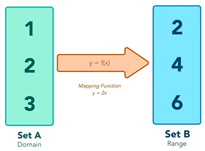

# Map, Filter e Reduce

**Objetivo**:

- Demonstrar a utilização de três métodos importantes para Arrays

  

## Map

**Objetivo**:

- Conhecer a implementação do método map

### O que é?

É quando um conjunto passa por uma operação e se torna outro conjunto

Assim, podemos dizer que:

1. Cria um novo array
2. Não modifica o array original
3. Realiza as operações em ordem

### Sintaxe

array.**map**(callback, thisArg)

- callback(item, index, array)

**Callback**: função a ser executada em cada elemento

**thisArg (opicional)**: valor de 'this' dentro da função de callback

### Map vs forEach

const array = [1, 2, 3, 4, 5];

arrayMultiplicado = array.**map**((*item*) => *item* * 2);

console.log(arrayMultiplicado)

- Resultado: [2, 4, 6, 8, 10]

const array = [1, 2, 3, 4, 5];

arrayMultiplicado = array.**forEach**((*item*) => *item* * 4);

console.log(arrayMultiplicado)

- Resultado: **undefined**

Assim, de forma resumida, a diferença é:

1. Valor de retorno
2. É necessário verificar a necessidade de utilização de um array auxiliar para continuar as operações

## Filter

**Objetivo**: 

- Conhecer a aplicação do método **filter**

### O que é

Como se colocasse todo o array dentro do filtro e apenas os itens que correspondem a determinada condição vão ser retornados no novo array que vai ser criado

- Cria um novo array
- Não modifica o array original

### Sintaxe

array.**filter**(callback, thisArg)

**Callback**: função a ser executada em cada elemento

**thisArg (opicional)**: valor de 'this' dentro da função de callback

**Exemplo**:

const frutas = ['maçã fuji', 'laranja', 'abacaxi', 'morango', 'maçã verde'];

let filtro = frutas.filter((*fruta*) => *fruta*.includes('maçã'));

console.log(filtro);

- Resultado: ['maçã fuji', 'maçã verde']

## Reduce

**Objetivo**: 

- Conhecer a implementação do método **reduce**

### O que é

- Executa uma função em todos os elementos do array, retornando um valor único

### Sintaxe

array.**reduce**(callbackFn, initialValue)

**Callback**: função a ser executada a partir do acumulador

**initialValue**: valor sobre o qual o retorno final irá atuar

**Exemplo**:

**Accumulator/prevValue**: acumulador de todas as chamadas de callbackFn

**currentValue**: elemento atual sendo acessado pela função
