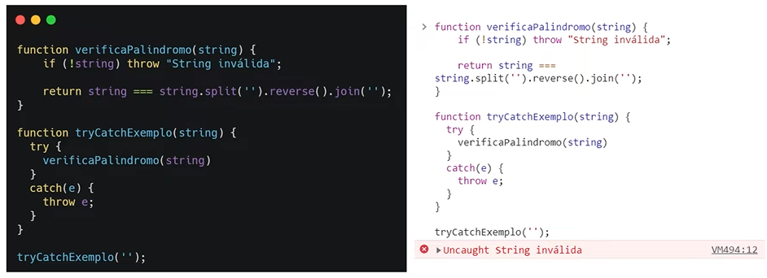

# Tratamento de erros

**Objetivo**:

1. Mostrar como lidar com erros e exceções;
2. Ensinar como criar seu próprio erro personalizado;

## Tipos de erros

**Objetivo**:

1. Apresentar o objeto **Error do ECMASript**
2. Apresentar a **DOMException**

### ECMAScript Error

- São erros que ocorrem em tempo de execução

Composto por:

- Mensagem
- Nome
- Linha
- Call Stack

### DOMException

- São erros relacionados ao **D**ocument **O**bject **M**odel (DOM) 

## Tratando erros

**Objetivo**:

1. Explicar a diferença entre **"trhow"** e **"return"**

2. Apresentar a implementação da declaração **try/catch**

### Throw

- **Throw vs Return **
  - Por exemplo: na função abaixo estamos vendo se a string enviada é um palindromo ou não (lida da esquerda para a direita e da direita para esquerda deve dar o mesmo resultado). Neste caso, se **não** for uma **string** o programa retornará "String inválida", já utilizando **throw** retornará um erro no programa.

### Try...catch

- Utilizando o **throw**

- Utilizando o **finally**

- Enviando uma **string verdadeira**, a resposta deve ser **true**, afirmando que o argumento inserido é uma **string** de fato

## Criando erros

**Objetivo**:

- Explicar como manipular o objeto **Error**

### Estrutura

// new Error(message, fileName, lineNumber) -> Todos os parâmetros são opcionais

const MeuErro = new Error('Mensagem inválida');

throw MeuErro;

**O erro também pode ter um nome**. Caso a gente queira que o nome do meu erro seja "InvalidMessage", depois de declarar o erro a gente pega o objeto e faz **.name**, por exemplo:

const MeuErro = new Error('Mensagem inválida');

MeuErro.name = 'InvalidMessage';

throw MeuErro;

### Links auxiliares

- [Objeto Error](https://developer.mozilla.org/pt-BR/docs/Web/JavaScript/Reference/Global_Objects/Error)
- [instanceof](https://developer.mozilla.org/pt-BR/docs/Web/JavaScript/Reference/Operators/instanceof)
- [typeof](https://developer.mozilla.org/pt-BR/docs/Web/JavaScript/Reference/Operators/typeof)
- [try...catch](https://developer.mozilla.org/pt-BR/docs/Web/JavaScript/Reference/Statements/try...catch)

