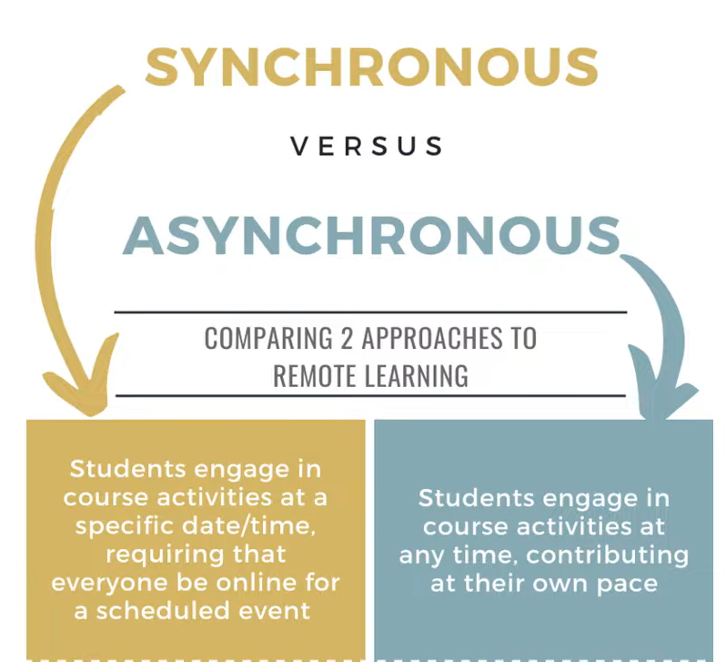
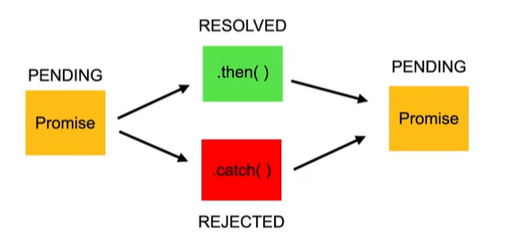
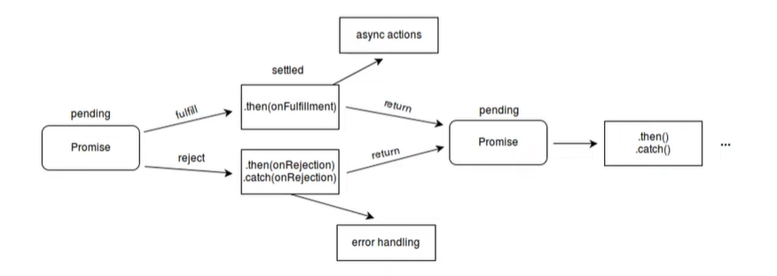
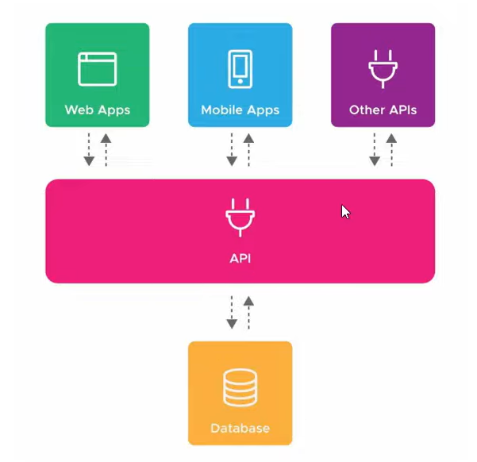
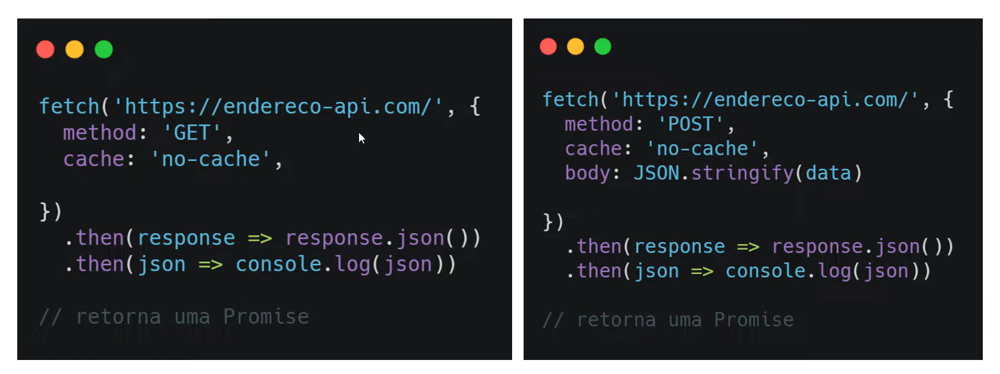

# Assincronicidade

### Objetivo:

1. Explicar o conceito de assincronicidade
2. Aprender promises
3. Ensinar como fazer requisições de APIs

## Promises e Async/Await

**Objetivo**:

1. Explicar o que são promisses
2. Ensinar como manipulá-las
3. Apresentar as palavras chave 'async' e 'await'

### Assíncrono

- 'Que não ocorre ou não se efetiva ao mesmo tempo'

O **JavaScript** por padrão vai rodar de maneira **síncrona**

### Promises

- Objeto de processamento **assíncrono**

Inicialmente seu valor é desconhecido. Ela pode ser então, **resolvida** ou **rejeitada**.

A **promisse** possui 3 estados:

1. Pending
2. Fulfilled / Resolved
3. Rejected

#### Estrutura

const myPromise = new Promise ((resolve, reject) => {

​	window.setTimeout(() =>{

​		resolve(console.log('Resolvida'));

}, 2000);

});

### Await

await myPromise

  .then((*result*) => *result* + ' passando pelo then')

  .then((*result*) => *result* + ' e agora acabou!')

  .catch((*err*) => console.log(*err*.message));

### Assíncrono e Await

async function resolvePromise() {

​	const myPromise = new Promise ((resolve, reject) => {

​		window.setTimeout(() => {

​			resolve('Resolvida');

​		}, 3000);

​	});

​	const resolved = await myPromise

​	  .then((*result*) => *result* + ' passando pelo then')

​	  .then((*result*) => *result* + ' e agora acabou!')

​	  .catch((*err*) => console.log(*err*.message));

​	return resolved;

}

#### Utilizando o try....catch

async function resolvePromise() {

​	const myPromise = new Promise ((resolve, reject) => {

​		window.setTimeout(() => {

​			resolve('Resolvida');

​		}, 3000);

​	});

​	let result;

​		try {

​	result = await myPromise

​		.then((result) => result + ' passando pelo then')

​		.then((result) => result + ' e agora acabou!')

} catch(err) {

​	result = err.message;

}

​	return result;

}

## APIs e Fetch

**Objetivo**:

1. Explicar o que são APIs
2. Ensinar como lidar com requisições dessas APIs
3. Apresentar o método fetch()

### API (Application Programming Interface)

Uma API é uma forma de intermediar os resultados do **back-end** com o que é apresentado no **front-end**

Conseguimos acessá-las por meio de URLs.

- **É muito comum que as APIs retornem seus dados no formato .json (Java Script Object Notation), portanto precisamos tratar estes dados quando os recebermos**

### Fetch

fetch(url, options)

​	.then(response => response.json())

​	.then(json => console.log(json))

// retorna uma Promise, ou seja, isto significa que precisamos utilizar o **await** quando utilizarmos o **fetch**

- Operações no banco (POST, GET, PUT, DELETE, etc...)

