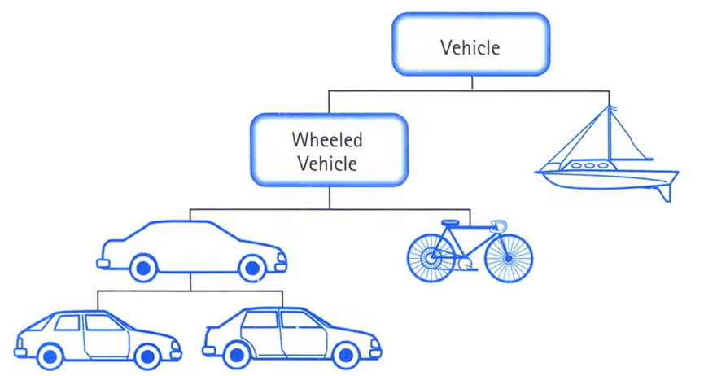
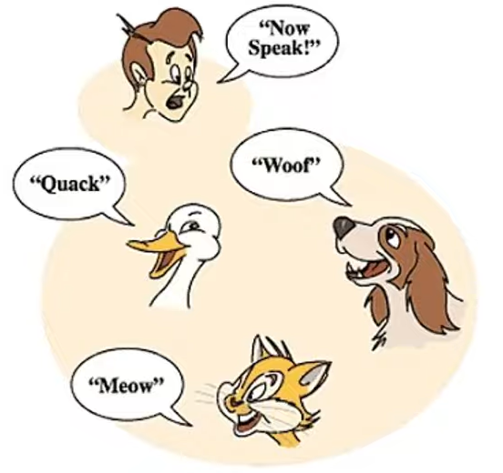
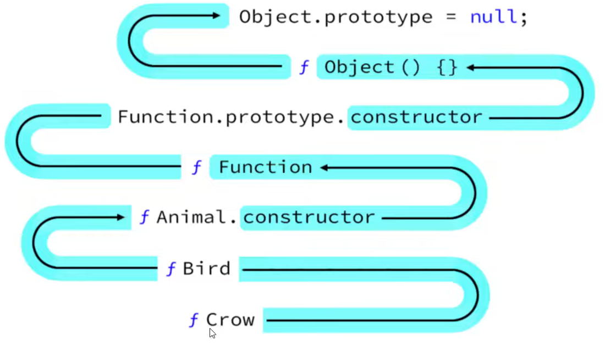
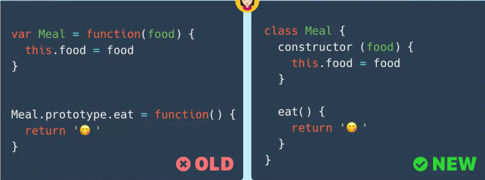
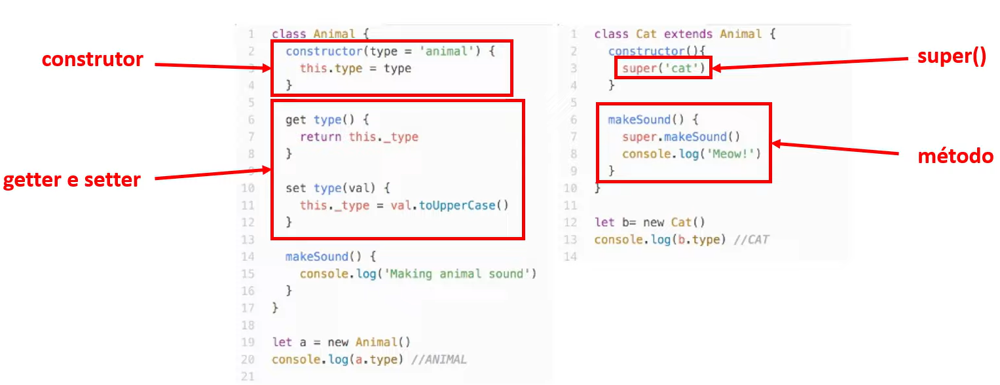

# Compreendendo Orientação a Objetos

**Objetivo do Curso**:

1. Explicar o conceito de Orientação a Objetos;
2. Apresentar seus pilares principais
3. Explicar como o JavaScript lida com este paradigma

## Introdução

A programação possui 2 paradigmas:

- Imperativo
- Declarativo

**Imperativo**: Sempre foca em como você vai resolver seus problemas;

**Declarativo**: Em o que você vai fazer; Ex: Banco de dados em SQL

Na orientação a objetos os programas são **"objetos"** que possuem uma série de propriedades.

Posso ter o objeto pessoa e a pessoa tem outras propriedades, por exemplo: tem altura, tem nome, tem cidade, tem cpf...

Existem 4 pilares para orientação a objeto:

1. Herança
2. Polimorfismo
3. Encapsulamento
4. Abstração

### Abstração

- "Processo mental que consiste em isolar um determinado aspecto de um estado de coisas relativamente complexo, a fim de simplificar a sua avaliação, classificação ou para permitir a comunicação do mesmo"

De forma resumida, temos um problema complexo e abstração é torná-los cada vez mais simples. Carros são objetos complexos, se abstrairmos ele, diremos que é um veículo de rodas, em seguida se abstrairmos mais ele é um veículo.

### Herança

- O objeto filho herda propriedades e métodos do objeto pai, mas objetos filhos também possuem suas próprias características.

### Encapsulamento

- Consiste no conceito de que cada classe tem propriedades e métodos independentes do restante do código. 

**Exemplo**: Aquela propriedade corresponde apenas aquela classe, se aquela propriedade mudar, irá afetar apenas aquela classe e não influenciará no restante do código.

### Polimorfismo

- Objetos podem herdar a mesma coisa da classe pai, mas se comportam de forma diferente quando invocamos seus métodos.

**Exemplo**: A classe **pai** é o **animal** que possui o **método falar**. No entanto, falam de forma diferente.

## JavaScript Orientado a Objetos (OOJS)

**Objetivos**:

1. Apresentar o conceito de protótipos e cadeia de protótipos
2. Apresentar a estrutura de classes em JavaScript

### Protótipos

Os protótipos em JavaScript são basicamente o esqueleto de todos os objetos. Então **todos os objetos** em JavaScript **vão herdar propriedades e métodos** de um **prototype** e o **Object.prototype** está no topo desta cadeia.

#### Cadeia de protótipos (prototype chain)

### Classes

**Syntatic sugar**: uma sintaxe feita para facilitar a escrita

- JavaScript não possui classes nativamente. Todas as classes são objetos e a herança se dá por protótipos.

