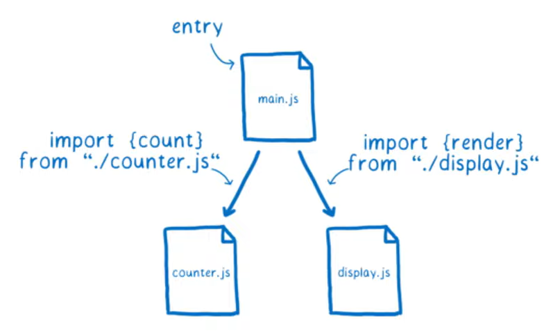
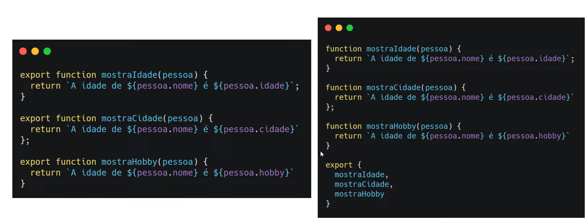
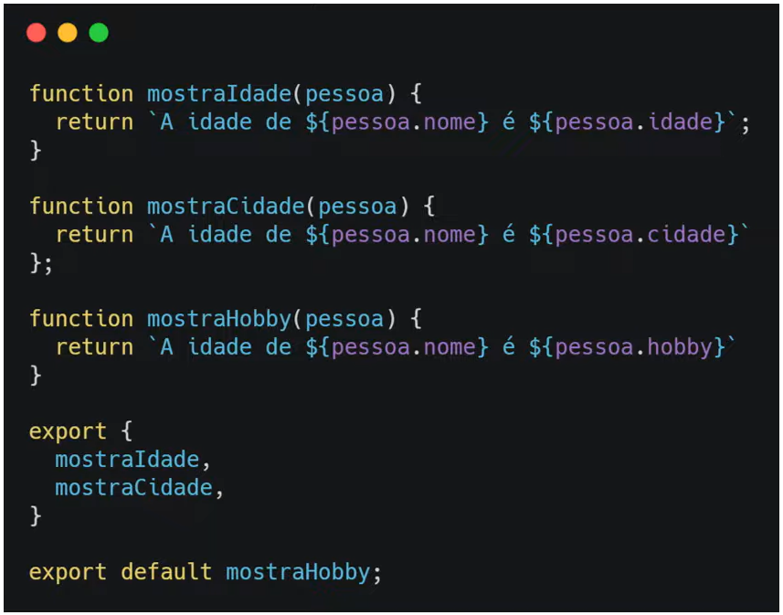
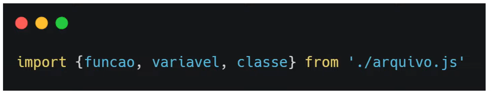
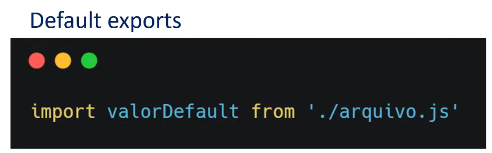
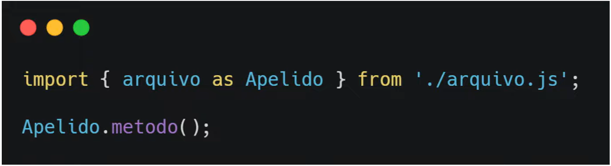
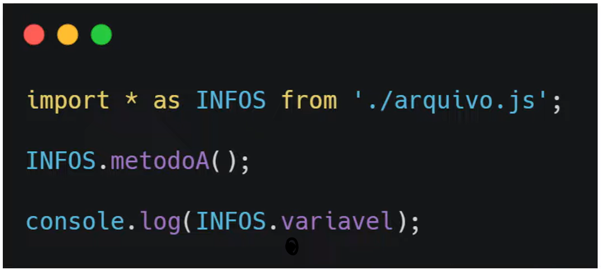
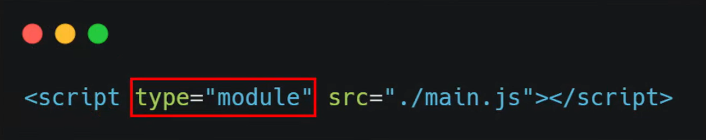
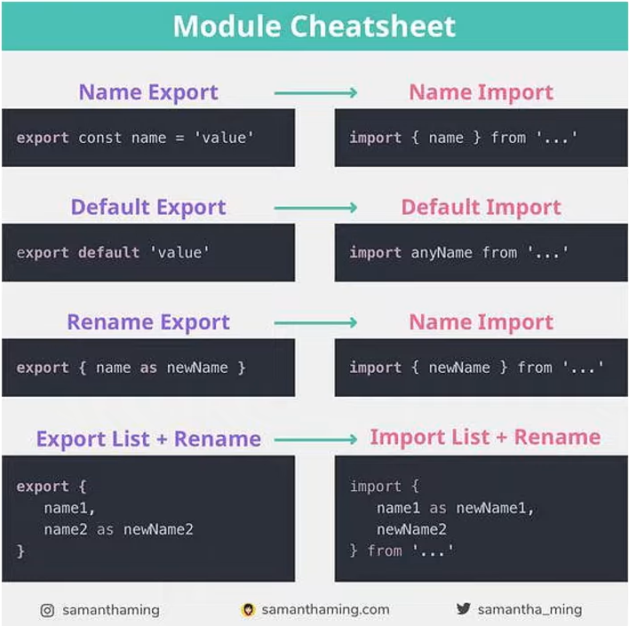

# Trabalhando com módulos em JavaScript

**Objetivos**:

- Explicar a necessidade do uso de módulos;
- Ensinar como utilizá-los.

## Utilizando módulos

**Objetivos**:

1. Explicar o que são os módulos;
2. Ensinar como utilizar esses módulos;
3. Alertar para algumas particularidades.

### O que são módulos?

- Módulos são arquivos em JavaScript que tem a capacidade de **exportar** e **importar** informações de **outros arquivos** do mesmo tipo.

**Vantagens**:

- Organização do código;
- Compartilhamento de variáveis em escopos diferentes;
- Explicita as dependências dos arquivos.

### Como exportar

Nós conseguimos exportar essas informações dos arquivos de 2 formas:

1. Named exports
2. Default exports

#### Named exports

Quando você quer exportar mais de uma coisa de um arquivo e quando você precisa exportá-las individualmente.

#### Default exports

O default exports é utilizado de forma diferente. Quando ele é utilizado, só pode haver um **default export** por arquivo. E ele será o retorno padrão do seu arquivo.

Quando você exporta com default export, virá só aquela parte do arquivo.

### Como importar

Nós conseguimos importar essas informações **também** de 2 formas:

1. Named exports
2. Default exports

###  

#### Named exports

#### Default exports

#### Trocando nom de imports

Uma coisa que podemos fazer, e ajuda muito, é dar um apelido para uma certa função, por exemplo:

Outra maneira de importar informações é utilizando a (*) para importar tudo de um arquivo.

### Vinculando ao HTML

- Para fazer testes localmente (de um arquivo no nosso computador), será necessário estar rodando um servidor. Isso pode ser feito utilizando a extensão "Live Server", do VS Code.

### Curiosidades

- Módulos sempre estão em "strict mode"
- Podem ser utilizadas as extensões .js e .mjs
- Para testes locais, é necessário utilizar um servidor
- Ao importar, sempre lembre da extensão (.js ou .mjs)
- Ao importar, sempre utilize "./" como ponto de partida

