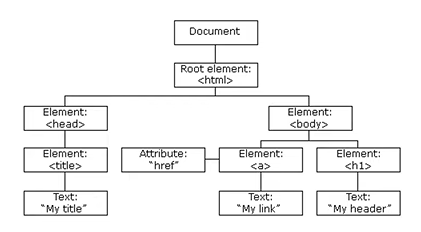
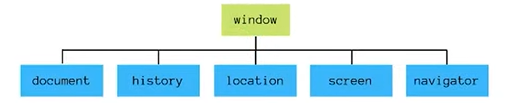
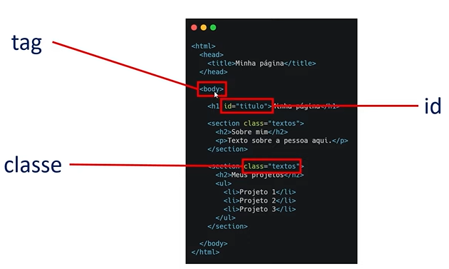
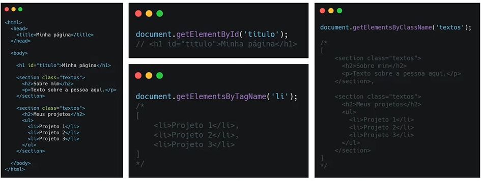
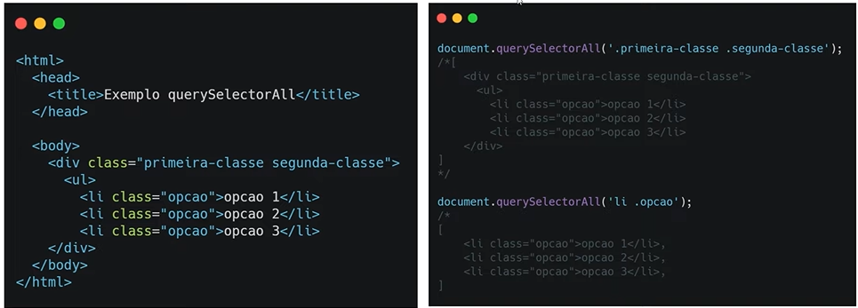
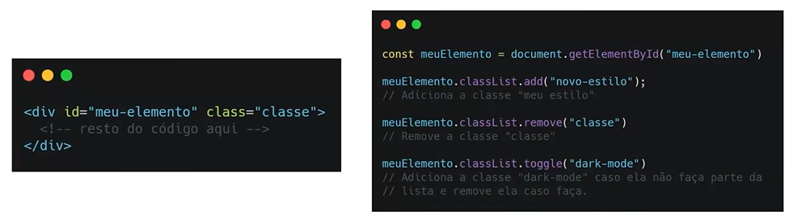
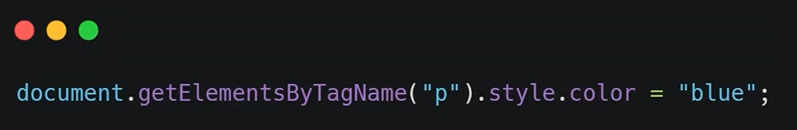
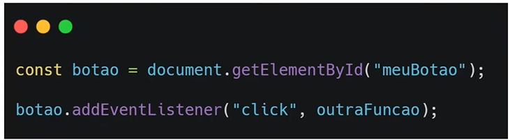
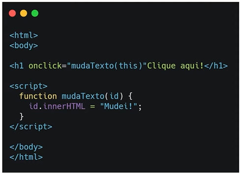

# D.O.M.

**Objetivos**:

1. Explicar o que é o DOM;
2. Esclarecer as diferenças entre o D.O.M. e B.O.M.
3. Principais métodos para manipular páginas da web

## O que é D.O.M.

- **D**ocument **O**bject **M**odel

O DOM HTML é um padrão de como **acessar e modificar os elementos HTML de uma página**

Todos os browsers vão ter este documento. Dentro do navegador temos o elemento **documento**, onde neste exemplo temos uma árvore de hierarquia, onde o elemento documento possui um filho (que é o elemento raíz - elemento principal **< html >** ) e dentro do arquivo html, nós temos várias tags filhas (que vão ter outras tags filhas ou não). Mas cada um desses elementos é chamado de nó, e cada um desses nós pode ter filhos ou não.

## D.O.M vs B.O.M

**B.O.M.** : **B**rowser **O**bject **M**odel

Tudo que está dentro do objeto window

Basicamente, sempre que você abre um browser (qualquer browser), ele possui a window (janela), então quando abrimos o console, a gente pode acessar essa propriedade window, e ela é a **mãe** de tudo. Então o **BOM** é isto, é a árvore de dependencias que existe dentro da janela (conforme imagem acima), e dentro dela está o nosso **DOM** (que é o ***document***). Mas na janela, que é acima do nosso DOM, teremos também o histórico, localização, tela, navegador ... 

*De forma resumida: Tudo que está na janela (window) faz parte do **BOM**, mas não faz parte do **DOM**. O DOM é um dos filhos do BOM.*

## Métodos

### Manipulando o DOM

**Objetivos**:

- Apresentar a estrutura em HTML;
- Apresentar métodos para interagir com os elementos de uma página;

### Estrutura HTML

### Selecionando os elementos de uma página

Podemos acessá-los de diferentes formas, por exemplo:

- document.getElementById('título');
- document.getElementsByTagName('li');
- document.getElementsByClassName('textos');
- document.querySelectorAll('.primeira-classe .segunda-classe');

### Adicionar e deletar elementos

|             Método              |         Descrição          |
| :-----------------------------: | :------------------------: |
| document.createElement(element) | Cria um novo elemento HTML |
|  document.removeChild(element)  |     Remove um elemento     |
|  document.appendChild(element)  |    Adiciona um elemento    |
| document.replaceChild(new, old) |   Substitui um elemento    |

## Trabalhando com estilos

**Objetivo**:

- Aprender a manipular estilos de elementos HTML

### Classes

- element.classList

### CSS

- Acessando diretamente o CSS de um elemento

## Eventos

- São quaisquer tipo de ações que um usuário realiza em uma página da Web

**Objetivos**:

1. Explicar o que são os eventos;
2. Apresentar os eventos comumente mais utilizados;
3. Ensinar como acionar estes eventos;

### Tipos

**Eventos do mouse**: Mouseover; mouseout

**Eventos de clique**: click, dbclick

**Eventos de atualização**: Change, load

### Acionando eventos

##### Event listener

- Diretamente no JavaScript, deve-se criar um evento que vai ser acionado no momento em que o usuário realizar determinada ação ( utilizando o **.addEventListener("click", outraFuncao)** )

##### Atributo HTML

- Especifica a função a ser chamada diretamente no elemento HTML

