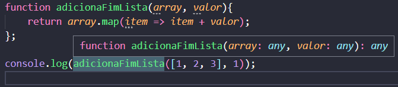
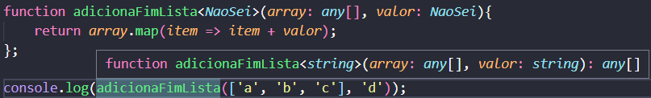
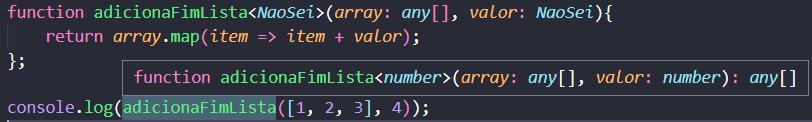
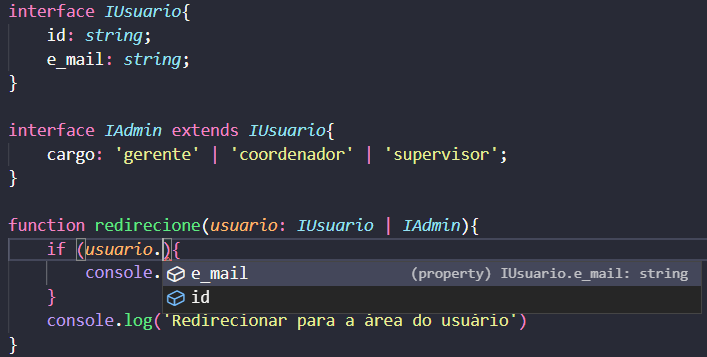

# TypeScript: Explorando Classes, Tipos e Interfaces

**Objetivos**:

- Aprender um pouco mais sobre o TypeScript e suas particularidades;

## Escrevendo a função soma em TypeScript

Em Js escrevemos a função soma da seguinte maneira:

function somaDoisNumeros(*a*, *b*){

  return *a* + *b*;

}

Então, se fizermos:

- console.log(somaDoisNumeros(**5, 10**));

O **resultado** será:

- 15

No entanto, se fizermos:

- console.log(somaDoisNumeros(**a, b**));

O **resultado** será:

- ab

Então, para construirmos uma barreira para isso, temos que fazer:

function somaDoisNumeros(*a*, *b*){

  if (typeof *a* === 'number' && typeof *b* === 'number'){

​    return *a* + *b*;

  } else{

​    return "A entrada não é do tipo NUMBER. Favor entrar com valores do tipo NUMBER."

  }

}

console.log(somaDoisNumeros(5, 10));

- **Resultado:** 15

console.log(somaDoisNumeros('a', 'b'));

- **Resultado:** A entrada não é do tipo NUMBER. Favor entrar com valores do tipo NUMBER.

No **TypeScript** isto é diferente, fazemos da seguinte forma:

function somaDoisNumeros(**a: number, b: number**){

  return *a* + *b*;

} 

## Interfaces

- Utilizamos **interfaces** para definir **contratos** (contratos de uma estrutura de dados, contratos de classes...)

Por exemplo, vamos implementar uma interface para animal:

interface *IAnimal*{

  nome: *string*;

  tipo: 'terrestre' | 'aquático';

  executarRugido(*alturaEmDecibeis*: *number*): *void*;

}

interface *IFelino* extends *IAnimal*{

  visaoNoturna: *boolean*;

}

const animal: *IAnimal* = {

  nome: 'Elefante',

  tipo: 'terrestre',

  executarRugido: (*alturaEmDecibeis*) => (`${*alturaEmDecibeis*}dB`),

}

const felino: *IFelino* = {

  nome: 'Elefante',

  tipo: 'terrestre',

  executarRugido: (*alturaEmDecibeis*) => (`${*alturaEmDecibeis*}dB`),

  visaoNoturna: true,

}

## Types

- Utilizamos o **type** para juntar diferentes interfaces, ou definir que uma variável pode ser uma interface ou outra interface.

Por exemplo:

interface *IAnimal* {

  nome: *string*;

  tipo: 'terrestre' | 'aquático';

  domestico: *boolean*;

}

interface *IFelino* extends *IAnimal*{

  visaoNoturna: *boolean*;

}

interface *ICanino* extends *IAnimal*{

  porte: 'pequeno' | 'medio' | 'grande';

}

type *TDomestico* = *IFelino* | *ICanino*;

const animal: *TDomestico* = {

  domestico: true,

  nome: 'cachorro',

  porte: 'medio',

  tipo: 'terrestre',

}

## Generic Types

Vamos supor que temos uma função que vai somar aos números já existentes de um array o número informado.

**Por exemplo**:

function adicionaFimLista(*array*, *valor*){

  return *array*.map(*item* => *item* + *valor*);

};

console.log(adicionaFimLista([1, 2, 3], 1));

- **Resultado**: [ 2, 3, 4 ]

No entanto, podemos notar que como não definimos nenhum parâmetro para a função, o JavaScript entende que pode ser qualquer valor, mas se inserirmos strings na função, também irá funcionar.

**Por exemplo**:

function adicionaFimLista(*array*, *valor*){

  return *array*.map(*item* => *item* + *valor*);

};

console.log(adicionaFimLista(['a', 'b', 'c'], 'd'));

- **Resultado**: ['ad', 'bd', 'cd']

**No entanto**, se utilizarmos '<>' na **function**, estamos dizendo que esta function irá receber um parâmetro genérico. Na imagem abaixo quando o parâmetro torna-se uma **string** a function retorna que é uma **string**.

Mas quando o parâmetro torna-se um **number** a function retorna que é uma **number**.

Por **padrão**, quando é um argumento que não sabemos, no lugar de ***NaoSei*** coloca-se ***T***.

## Desenvolvendo condicionais a partir de parâmetros

Quando o JavaScript não te dá opção de acessar algum parâmetro de outra interface, como o exemplo abaixo, podemos checar se está inbutido neste parâmetro a informação contida na outra interface.

Como, **por exemplo**:

interface *IUsuario*{

  id: *string*;

  e_mail: *string*;

}

interface *IAdmin* extends *IUsuario*{

  cargo: 'gerente' | 'coordenador' | 'supervisor';

}

function redirecione(*usuario*: *IUsuario* | *IAdmin*){

  if (**'cargo' in *usuario***){

​    console.log('Redirecionar para a área de administração')

  }

  console.log('Redirecionar para a área do usuário')

}

const usuario_1: *IUsuario* = {

  id: '1',

  e_mail: 'luciano@gmail.com',

}

const usuario_2: *IAdmin* = {

  id: '2',

  e_mail: 'rafaela@gmail.com',

  cargo: 'gerente',

}

## Utilizando o caracter "?"

Quando utilizamos o caracter **"?"** estamos dizendo que aquilo pode ser um dado opcional, por **exemplo**:

interface *IUsuario*{

  id: *string*;

  e_mail: *string*;

  **cargo?:** 'gerente' | 'coordenador' | 'supervisor' | 'funcionario';

}

function redirecione(*usuario*: *IUsuario*){

  if (*usuario*.cargo){

​    //redirecionar(usuario.cargo);

  }

  // redirecionar para a área do usuário

}

## Criando variáveis com propriedade readonly e private

interface *cachorro*{

  nome: *string*;

  idade: *number*;

  parqueFavorito?: *string*; ***(opicional)***

}

type *cachorroSomenteLeitura* = {

  readonly [*K* in keyof *cachorro*]: *cachorro*[*K*];

}

const meuCachorro: *cachorro* = {

  nome: 'Lolly',

  idade: 2,

  parqueFavorito: 'Central Park',

}

class cachorrinho implements *cachorro*{

  constructor(*nome*, *idade*){

​    *this*.nome = *nome*;

​    *this*.idade = *idade*;

  }

  nome;

  idade;

}

## Como importar bibliotecas em TypeScript

É muito comum utilizar as bibliotecas externas para auxiliar nos projetos. Mas o que fazemos para extender a biblioteca, mas sem mexer nos **types** que estão definidos no interior dela? O **TypeScript** tem um padrão para isto.

- É preciso criar um arquivo typings.d.ts (que vai definir os typings gerais da minha aplicação);

## Omit

Utilizado em momentos em que podemos 'omitir' alguma informação, **por exemplo**:

interface *IPessoa*{

  nome: *string*;

  idade: *number*;

  nacionalidade: *string*;

}

**interface *IBrasileiro* extends *Omit*<*IPessoa*, 'nacionalidade'>{}**

const brasileiro: *IBrasileiro* = {

  nome: 'Luciano',

  idade: 25,

}

- No exemplo acima, fica claro que podemos omitir a nacionalidade, uma vez que a interface **IBrasileiro** corresponde a uma nacionalidade **Brasileira**.
